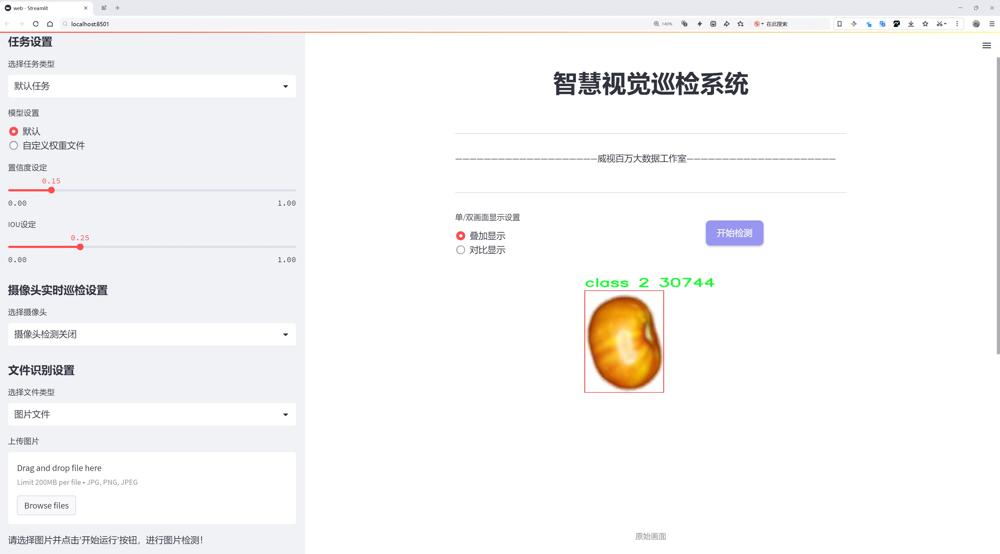
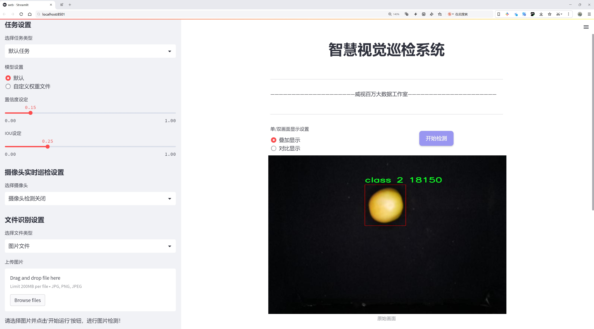
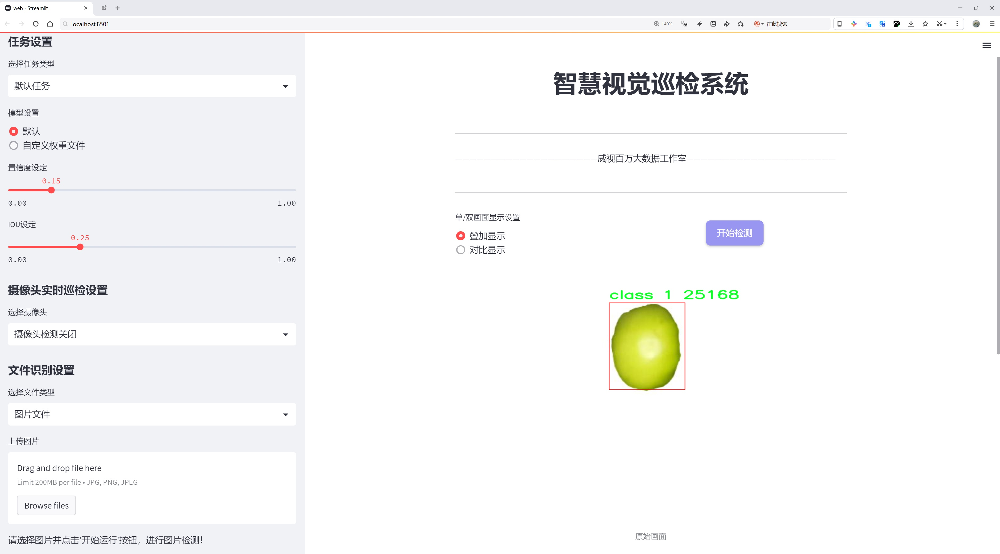
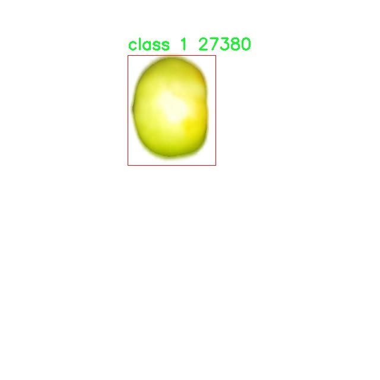
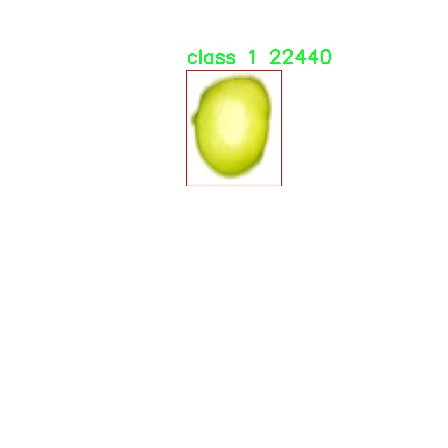
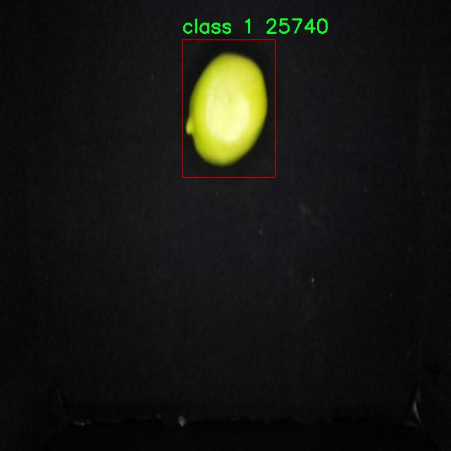
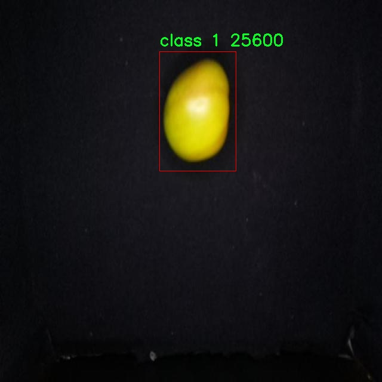
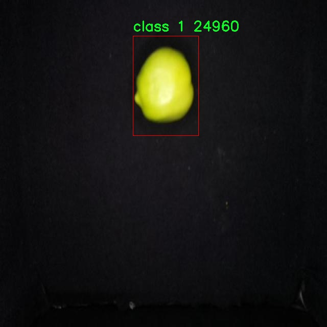

# 番茄成熟度检测检测系统源码分享
 # [一条龙教学YOLOV8标注好的数据集一键训练_70+全套改进创新点发刊_Web前端展示]

### 1.研究背景与意义

项目参考[AAAI Association for the Advancement of Artificial Intelligence](https://gitee.com/qunmasj/projects)

项目来源[AACV Association for the Advancement of Computer Vision](https://kdocs.cn/l/cszuIiCKVNis)

研究背景与意义

随着全球人口的不断增长，农业生产的效率和质量面临着前所未有的挑战。番茄作为一种重要的经济作物，其成熟度的检测不仅关系到农产品的市场价值，也直接影响到消费者的饮食安全和健康。因此，如何准确、快速地判断番茄的成熟度，成为了现代农业生产中亟待解决的问题。传统的番茄成熟度检测方法多依赖于人工观察和经验判断，这不仅效率低下，而且容易受到主观因素的影响，导致检测结果的不准确性和不一致性。随着计算机视觉和深度学习技术的快速发展，基于图像处理的自动化检测方法逐渐成为研究的热点。

在这一背景下，YOLO（You Only Look Once）系列目标检测算法因其高效性和实时性，成为了众多研究者关注的焦点。YOLOv8作为该系列的最新版本，具备了更强的特征提取能力和更快的检测速度，能够在复杂的环境中实现高精度的目标检测。通过对YOLOv8算法的改进，结合番茄成熟度检测的具体需求，可以构建一个高效、准确的番茄成熟度检测系统，从而为农业生产提供有力的技术支持。

本研究所使用的数据集包含1600张图像，涵盖了番茄成熟的六个不同阶段，分别为class 1至class 6。这一数据集的多样性和丰富性为模型的训练和测试提供了坚实的基础。通过对不同成熟度阶段的番茄进行标注和分类，研究者能够利用深度学习技术提取出关键特征，从而实现对番茄成熟度的准确识别。这不仅有助于提高番茄的采摘效率，降低人工成本，还能在一定程度上减少因成熟度判断失误而造成的经济损失。

此外，基于改进YOLOv8的番茄成熟度检测系统，能够为农业智能化发展提供重要的参考和借鉴。随着物联网和人工智能技术的不断发展，农业生产正朝着智能化、自动化的方向迈进。通过将成熟度检测系统与农业生产管理系统相结合，可以实现对番茄生长过程的实时监控和数据分析，帮助农民做出更加科学的决策，提高农业生产的整体效率。

综上所述，基于改进YOLOv8的番茄成熟度检测系统的研究，不仅具有重要的理论意义，也具备广泛的应用前景。通过提升番茄成熟度检测的准确性和效率，可以为农业生产的现代化转型提供强有力的技术支持，推动农业产业的可持续发展。未来，随着技术的不断进步和数据集的不断丰富，基于深度学习的成熟度检测系统有望在更多的农作物检测中得到应用，为全球农业生产带来更大的变革。

### 2.图片演示







##### 注意：由于此博客编辑较早，上面“2.图片演示”和“3.视频演示”展示的系统图片或者视频可能为老版本，新版本在老版本的基础上升级如下：（实际效果以升级的新版本为准）

  （1）适配了YOLOV8的“目标检测”模型和“实例分割”模型，通过加载相应的权重（.pt）文件即可自适应加载模型。

  （2）支持“图片识别”、“视频识别”、“摄像头实时识别”三种识别模式。

  （3）支持“图片识别”、“视频识别”、“摄像头实时识别”三种识别结果保存导出，解决手动导出（容易卡顿出现爆内存）存在的问题，识别完自动保存结果并导出到tempDir中。

  （4）支持Web前端系统中的标题、背景图等自定义修改，后面提供修改教程。

  另外本项目提供训练的数据集和训练教程,暂不提供权重文件（best.pt）,需要您按照教程进行训练后实现图片演示和Web前端界面演示的效果。

### 3.视频演示

[3.1 视频演示](https://www.bilibili.com/video/BV17wxveSEu2/)

### 4.数据集信息展示

##### 4.1 本项目数据集详细数据（类别数＆类别名）

nc: 6
names: ['class 1', 'class 2', 'class 3', 'class 4', 'class 5', 'class 6']


##### 4.2 本项目数据集信息介绍

数据集信息展示

在本研究中，我们使用了名为“6 Stages of Tomato Maturity”的数据集，以改进YOLOv8模型在番茄成熟度检测系统中的表现。该数据集专门针对番茄的不同成熟阶段进行了精心标注，涵盖了六个成熟度类别，分别为“class 1”、“class 2”、“class 3”、“class 4”、“class 5”和“class 6”。这些类别代表了从未成熟到完全成熟的不同状态，为我们提供了一个丰富的基础，以训练和优化深度学习模型。

“6 Stages of Tomato Maturity”数据集的设计初衷是为了帮助研究人员和开发者在农业领域实现更高效的作物监测和管理。每个类别的样本均经过严格筛选和标注，确保其代表性和准确性。具体而言，“class 1”代表的是番茄的初始生长阶段，通常为绿色且表面光滑；而“class 6”则表示番茄的完全成熟状态，呈现出鲜艳的红色和丰富的风味。这种逐级的分类不仅便于模型的学习，也为后续的应用提供了明确的目标。

在数据集的构建过程中，研究团队收集了大量的番茄图像，涵盖了不同的生长环境、光照条件和拍摄角度。这种多样性确保了模型在实际应用中的鲁棒性，使其能够适应各种复杂的场景。此外，数据集中的图像均经过高质量的预处理，以提高图像的清晰度和可辨识度，从而为模型的训练提供更好的输入。

为了确保模型能够有效地学习到不同成熟阶段的特征，我们在数据集中采用了数据增强技术。这包括旋转、缩放、裁剪和颜色调整等操作，旨在增加样本的多样性，减少过拟合的风险。通过这些技术，我们不仅扩展了数据集的规模，还提高了模型在不同条件下的泛化能力。

在模型训练过程中，我们将“6 Stages of Tomato Maturity”数据集划分为训练集、验证集和测试集，以便于对模型的性能进行全面评估。训练集用于模型的学习，验证集用于调整超参数，而测试集则用于最终的性能评估。通过这种方式，我们能够确保模型在不同数据集上的表现一致性，从而提高其在实际应用中的可靠性。

总之，“6 Stages of Tomato Maturity”数据集为改进YOLOv8的番茄成熟度检测系统提供了坚实的基础。通过精心设计的类别划分、丰富的样本多样性以及有效的数据增强策略，我们的目标是构建一个高效、准确的检测系统，能够在农业生产中发挥重要作用，助力智能农业的发展。随着技术的不断进步，我们期待这一系统能够在实际应用中为农民和农业管理者提供更为科学和高效的决策支持。











### 5.全套项目环境部署视频教程（零基础手把手教学）

[5.1 环境部署教程链接（零基础手把手教学）](https://www.ixigua.com/7404473917358506534?logTag=c807d0cbc21c0ef59de5)


[5.2 安装Python虚拟环境创建和依赖库安装视频教程链接（零基础手把手教学）](https://www.ixigua.com/7404474678003106304?logTag=1f1041108cd1f708b01a)

### 6.手把手YOLOV8训练视频教程（零基础小白有手就能学会）

[6.1 手把手YOLOV8训练视频教程（零基础小白有手就能学会）](https://www.ixigua.com/7404477157818401292?logTag=d31a2dfd1983c9668658)

### 7.70+种全套YOLOV8创新点代码加载调参视频教程（一键加载写好的改进模型的配置文件）

[7.1 70+种全套YOLOV8创新点代码加载调参视频教程（一键加载写好的改进模型的配置文件）](https://www.ixigua.com/7404478314661806627?logTag=29066f8288e3f4eea3a4)

### 8.70+种全套YOLOV8创新点原理讲解（非科班也可以轻松写刊发刊，V10版本正在科研待更新）

由于篇幅限制，每个创新点的具体原理讲解就不一一展开，具体见下列网址中的创新点对应子项目的技术原理博客网址【Blog】：


[8.1 70+种全套YOLOV8创新点原理讲解链接](https://gitee.com/qunmasj/good)

### 9.系统功能展示（检测对象为举例，实际内容以本项目数据集为准）

图9.1.系统支持检测结果表格显示

  图9.2.系统支持置信度和IOU阈值手动调节

  图9.3.系统支持自定义加载权重文件best.pt(需要你通过步骤5中训练获得)

  图9.4.系统支持摄像头实时识别

  图9.5.系统支持图片识别

  图9.6.系统支持视频识别

  图9.7.系统支持识别结果文件自动保存

  图9.8.系统支持Excel导出检测结果数据


### 10.原始YOLOV8算法原理

原始YOLOv8算法原理

YOLOv8算法是目标检测领域的一项重要进展，承载着YOLO系列模型的演变与创新。该算法的设计理念在于提高检测精度与速度，同时简化模型结构，使其在实际应用中更具灵活性和高效性。YOLOv8的架构由输入层、主干网络、特征融合层和解耦头组成，延续了YOLOv5和YOLOv7的设计思路，并在此基础上进行了多项关键改进。

在主干网络方面，YOLOv8采用了CSPDarknet结构，进一步优化了特征提取过程。具体而言，YOLOv8将YOLOv5中的C3模块替换为C2f模块，这一变化不仅实现了模型的轻量化，还在不牺牲检测精度的前提下，增强了特征提取的能力。C2f模块的设计灵感来源于ELAN思想，具备两个分支的结构，能够在梯度回传过程中提供更丰富的信息流。这种设计通过将输入特征图分为多个分支并进行融合，显著提升了模型对复杂特征的捕捉能力，尤其是在处理深层网络时，有效缓解了梯度消失和梯度爆炸的问题。

YOLOv8的特征融合层采用了PAN-FPN结构，这一结构的优势在于能够充分融合多尺度特征信息，提升模型对不同尺寸目标的检测能力。在YOLOv8中，PAN-FPN的实现经过了一些简化，例如在上采样阶段去除了1×1卷积层，使得特征融合过程更加高效。通过自下而上的融合方式，YOLOv8能够将高层特征与中层、浅层特征有效结合，确保每一层的特征图都包含了丰富的语义信息与细节信息，从而提升了目标检测的准确性。

在目标检测的实现上，YOLOv8引入了Anchor-Free的思想，抛弃了传统的Anchor-Base方法。这一创新使得模型能够直接预测目标的中心点及其宽高比例，减少了对Anchor框的依赖，进而提高了检测速度和准确度。YOLOv8的检测头部分采用了解耦结构，分类和回归任务被分开处理，这一设计借鉴了YOLOX和YOLOv6的解耦头结构，能够更好地捕捉目标的类别特征和位置特征。解耦头的实现通过分别对分类和回归分支进行处理，使得模型在处理复杂场景时表现得更加灵活和高效。

在损失函数的设计上，YOLOv8采用了VFLLoss作为分类损失，DFLLoss与CIoULoss作为回归损失。这一组合不仅能够有效解决样本不平衡问题，还能提高模型对难以分类样本的敏感度。VFLLoss通过不对称参数对正负样本进行加权，使得模型在训练过程中更加关注高质量的正样本，进而提升整体检测性能。

YOLOv8在样本匹配策略上也进行了创新，采用了TaskAligned的Assigner匹配方式。这一策略通过动态标签分配，解决了正负样本匹配中的多尺度分配问题，确保模型在训练过程中能够有效利用每一个样本，提高了训练的效率和效果。

数据预处理方面，YOLOv8延续了YOLOv5的策略，采用了多种数据增强手段，如马赛克增强、混合增强、空间扰动和颜色扰动等。这些增强手段能够有效提升模型的鲁棒性，使其在面对复杂背景和多样化目标时，依然能够保持良好的检测性能。

总的来说，YOLOv8算法在YOLO系列的基础上，通过引入新的模块和优化现有结构，显著提升了目标检测的精度和速度。其在特征提取、特征融合、目标检测和损失函数等多个方面的创新，使得YOLOv8成为当前目标检测领域的SOTA算法之一，展现了强大的应用潜力和广泛的适用性。随着YOLOv8的推广与应用，未来的目标检测任务将更加高效、准确，为各类智能视觉系统的实现提供了有力支持。


### 11.项目核心源码讲解（再也不用担心看不懂代码逻辑）

#### 11.1 ui.py

以下是对给定代码的核心部分进行保留和详细注释的版本：

```python
import sys
import subprocess

def run_script(script_path):
    """
    使用当前 Python 环境运行指定的脚本。

    Args:
        script_path (str): 要运行的脚本路径

    Returns:
        None
    """
    # 获取当前 Python 解释器的路径
    python_path = sys.executable

    # 构建运行命令，使用 streamlit 运行指定的脚本
    command = f'"{python_path}" -m streamlit run "{script_path}"'

    # 执行命令并等待其完成
    result = subprocess.run(command, shell=True)
    
    # 检查命令执行的返回码，非零表示出错
    if result.returncode != 0:
        print("脚本运行出错。")

# 实例化并运行应用
if __name__ == "__main__":
    # 指定要运行的脚本路径
    script_path = "web.py"  # 这里可以直接指定脚本名称，假设它在当前目录下

    # 调用函数运行脚本
    run_script(script_path)
```

### 代码分析与注释：

1. **导入模块**：
   - `sys`：用于访问与 Python 解释器相关的变量和函数。
   - `subprocess`：用于执行外部命令和与其交互。

2. **`run_script` 函数**：
   - 该函数接受一个参数 `script_path`，表示要运行的 Python 脚本的路径。
   - 使用 `sys.executable` 获取当前 Python 解释器的路径，以确保使用相同的环境运行脚本。
   - 构建一个命令字符串，使用 `streamlit` 模块运行指定的脚本。
   - 使用 `subprocess.run` 执行命令，并等待其完成。
   - 检查返回码，如果不为零，则输出错误信息，表示脚本运行出错。

3. **主程序块**：
   - 使用 `if __name__ == "__main__":` 确保该代码块仅在直接运行该脚本时执行，而不是在被导入时执行。
   - 指定要运行的脚本路径为 `web.py`，并调用 `run_script` 函数执行该脚本。

通过以上注释，可以清晰地理解代码的功能和每个部分的作用。

这个程序文件 `ui.py` 是一个用于运行 Python 脚本的简单工具，特别是用来启动一个 Streamlit 应用。首先，文件导入了必要的模块，包括 `sys`、`os` 和 `subprocess`，这些模块提供了与系统交互的功能。`abs_path` 函数来自 `QtFusion.path` 模块，用于获取文件的绝对路径。

在 `run_script` 函数中，程序接受一个参数 `script_path`，这是要运行的脚本的路径。函数的第一步是获取当前 Python 解释器的路径，这通过 `sys.executable` 实现。接着，程序构建了一个命令字符串，该命令使用当前的 Python 解释器和 Streamlit 模块来运行指定的脚本。具体的命令格式为 `"{python_path}" -m streamlit run "{script_path}"`，其中 `{python_path}` 和 `{script_path}` 会被实际的路径替换。

随后，程序使用 `subprocess.run` 方法执行这个命令，`shell=True` 参数允许在 shell 中执行命令。执行后，程序检查返回的结果，如果返回码不为零，表示脚本运行出错，此时会打印出错误信息。

在文件的最后部分，使用 `if __name__ == "__main__":` 语句来确保只有在直接运行该文件时才会执行以下代码。这里指定了要运行的脚本路径 `web.py`，并调用 `run_script` 函数来启动这个脚本。

总的来说，这个程序的主要功能是方便地运行一个 Streamlit 应用，通过封装命令行调用的方式，简化了用户的操作。

#### 11.2 70+种YOLOv8算法改进源码大全和调试加载训练教程（非必要）\ultralytics\hub\session.py

以下是经过简化并添加详细中文注释的核心代码部分：

```python
import signal
import sys
from time import sleep
import requests
from ultralytics.hub.utils import HUB_API_ROOT, HUB_WEB_ROOT, smart_request
from ultralytics.utils import LOGGER, checks
from ultralytics.utils.errors import HUBModelError

class HUBTrainingSession:
    """
    HUB训练会话类，用于管理Ultralytics HUB YOLO模型的初始化、心跳和检查点上传。
    """

    def __init__(self, url):
        """
        初始化HUBTrainingSession，使用提供的模型标识符。

        参数:
            url (str): 用于初始化HUB训练会话的模型标识符，可以是URL字符串或特定格式的模型键。

        异常:
            ValueError: 如果提供的模型标识符无效。
            ConnectionError: 如果连接全局API密钥不被支持。
        """
        # 解析输入的模型URL
        if url.startswith(f'{HUB_WEB_ROOT}/models/'):
            url = url.split(f'{HUB_WEB_ROOT}/models/')[-1]
        if [len(x) for x in url.split('_')] == [42, 20]:
            key, model_id = url.split('_')
        elif len(url) == 20:
            key, model_id = '', url
        else:
            raise HUBModelError(f"模型='{url}'未找到。请检查格式是否正确。")

        # 授权
        auth = Auth(key)
        self.model_id = model_id
        self.model_url = f'{HUB_WEB_ROOT}/models/{model_id}'
        self.api_url = f'{HUB_API_ROOT}/v1/models/{model_id}'
        self.auth_header = auth.get_auth_header()
        self.metrics_queue = {}  # 用于存储模型的指标
        self.model = self._get_model()  # 获取模型数据
        self.alive = True  # 心跳循环状态
        self._start_heartbeat()  # 启动心跳
        self._register_signal_handlers()  # 注册信号处理器
        LOGGER.info(f'查看模型在 {self.model_url} 🚀')

    def _register_signal_handlers(self):
        """注册信号处理器以优雅地处理终止信号。"""
        signal.signal(signal.SIGTERM, self._handle_signal)
        signal.signal(signal.SIGINT, self._handle_signal)

    def _handle_signal(self, signum, frame):
        """
        处理终止信号，防止在Colab中终止后发送心跳。

        参数:
            signum: 信号编号
            frame: 当前的栈帧（未使用）
        """
        if self.alive:
            LOGGER.info('收到终止信号! ❌')
            self._stop_heartbeat()  # 停止心跳
            sys.exit(signum)

    def _stop_heartbeat(self):
        """终止心跳循环。"""
        self.alive = False

    def _get_model(self):
        """从Ultralytics HUB获取并返回模型数据。"""
        api_url = f'{HUB_API_ROOT}/v1/models/{self.model_id}'
        try:
            response = smart_request('get', api_url, headers=self.auth_header, thread=False, code=0)
            data = response.json().get('data', None)

            if data.get('status') == 'trained':
                raise ValueError('模型已训练并上传。')

            if not data.get('data'):
                raise ValueError('数据集可能仍在处理，请稍后再试。')

            self.model_id = data['id']  # 更新模型ID

            # 根据模型状态设置训练参数
            if data['status'] == 'new':
                self.train_args = {
                    'batch': data['batch_size'],
                    'epochs': data['epochs'],
                    'imgsz': data['imgsz'],
                    'patience': data['patience'],
                    'device': data['device'],
                    'cache': data['cache'],
                    'data': data['data']
                }
                self.model_file = data.get('cfg') or data.get('weights')
                self.model_file = checks.check_yolov5u_filename(self.model_file, verbose=False)
            elif data['status'] == 'training':
                self.train_args = {'data': data['data'], 'resume': True}
                self.model_file = data['resume']

            return data
        except requests.exceptions.ConnectionError as e:
            raise ConnectionRefusedError('错误: HUB服务器未在线，请稍后再试。') from e

    @threaded
    def _start_heartbeat(self):
        """开始一个线程心跳循环，向Ultralytics HUB报告代理状态。"""
        while self.alive:
            r = smart_request('post',
                              f'{HUB_API_ROOT}/v1/agent/heartbeat/models/{self.model_id}',
                              json={'agent': AGENT_NAME, 'agentId': self.agent_id},
                              headers=self.auth_header,
                              retry=0,
                              code=5,
                              thread=False)  # 已在一个线程中
            self.agent_id = r.json().get('data', {}).get('agentId', None)  # 更新代理ID
            sleep(300)  # 每300秒发送一次心跳
```

### 代码说明：
1. **HUBTrainingSession类**：用于管理Ultralytics HUB的训练会话，包括模型的初始化、心跳监测和指标上传等功能。
2. **初始化方法**：解析模型URL，进行授权，获取模型数据，并启动心跳。
3. **信号处理**：注册信号处理器以优雅地处理终止信号，确保在接收到终止信号时停止心跳并退出程序。
4. **获取模型数据**：从Ultralytics HUB获取模型的相关信息，设置训练参数，并处理可能的错误。
5. **心跳机制**：通过一个线程定期向Ultralytics HUB发送心跳请求，报告代理的状态。

这个程序文件定义了一个名为 `HUBTrainingSession` 的类，主要用于管理 Ultralytics HUB 上 YOLO 模型的训练会话。它处理模型的初始化、心跳信号、检查点上传等功能。

在初始化时，构造函数接收一个模型标识符 `url`，并解析该标识符以获取模型的密钥和 ID。如果提供的 URL 格式不正确，程序会抛出一个 `HUBModelError` 异常。接着，程序会进行身份验证，并构建与 Ultralytics HUB 相关的 URL 和请求头信息。该类还定义了一些属性，例如速率限制、计时器、模型数据和心跳状态等。

类中有一个 `_register_signal_handlers` 方法，用于注册信号处理程序，以便在接收到终止信号时能够优雅地处理程序的关闭。`_handle_signal` 方法则用于处理这些信号，确保在 Colab 环境中接收到终止信号后停止心跳并退出程序。

`upload_metrics` 方法用于将模型的性能指标上传到 Ultralytics HUB。`_get_model` 方法从 HUB 获取模型数据，并根据模型的状态（如新模型、正在训练的模型等）设置训练参数和模型文件。若连接失败，则会抛出连接错误。

`upload_model` 方法用于将模型的检查点上传到 Ultralytics HUB。它会根据当前的训练轮次、权重文件和其他参数进行上传。最后，`_start_heartbeat` 方法启动一个线程，定期向 Ultralytics HUB 发送心跳信号，以报告代理的状态。

总的来说，这个类封装了与 Ultralytics HUB 进行交互的逻辑，简化了 YOLO 模型的训练和管理过程。

#### 11.3 70+种YOLOv8算法改进源码大全和调试加载训练教程（非必要）\ultralytics\nn\modules\conv.py

以下是代码中最核心的部分，并附上详细的中文注释：

```python
import torch
import torch.nn as nn

def autopad(k, p=None, d=1):  # kernel, padding, dilation
    """自动填充以保持输出形状不变。"""
    if d > 1:
        # 如果有膨胀(dilation)，计算实际的卷积核大小
        k = d * (k - 1) + 1 if isinstance(k, int) else [d * (x - 1) + 1 for x in k]
    if p is None:
        # 如果没有指定填充，自动计算填充大小
        p = k // 2 if isinstance(k, int) else [x // 2 for x in k]
    return p

class Conv(nn.Module):
    """标准卷积层，包含卷积、批归一化和激活函数。"""
    default_act = nn.SiLU()  # 默认激活函数

    def __init__(self, c1, c2, k=1, s=1, p=None, g=1, d=1, act=True):
        """初始化卷积层，包括输入通道、输出通道、卷积核大小、步幅、填充、分组、膨胀和激活函数。"""
        super().__init__()
        self.conv = nn.Conv2d(c1, c2, k, s, autopad(k, p, d), groups=g, dilation=d, bias=False)
        self.bn = nn.BatchNorm2d(c2)  # 批归一化
        self.act = self.default_act if act is True else act if isinstance(act, nn.Module) else nn.Identity()

    def forward(self, x):
        """前向传播：应用卷积、批归一化和激活函数。"""
        return self.act(self.bn(self.conv(x)))

class DWConv(Conv):
    """深度可分离卷积层。"""

    def __init__(self, c1, c2, k=1, s=1, d=1, act=True):
        """初始化深度可分离卷积层。"""
        super().__init__(c1, c2, k, s, g=math.gcd(c1, c2), d=d, act=act)

class ConvTranspose(nn.Module):
    """转置卷积层。"""
    default_act = nn.SiLU()  # 默认激活函数

    def __init__(self, c1, c2, k=2, s=2, p=0, bn=True, act=True):
        """初始化转置卷积层，包括批归一化和激活函数。"""
        super().__init__()
        self.conv_transpose = nn.ConvTranspose2d(c1, c2, k, s, p, bias=not bn)
        self.bn = nn.BatchNorm2d(c2) if bn else nn.Identity()
        self.act = self.default_act if act is True else act if isinstance(act, nn.Module) else nn.Identity()

    def forward(self, x):
        """前向传播：应用转置卷积、批归一化和激活函数。"""
        return self.act(self.bn(self.conv_transpose(x)))

class ChannelAttention(nn.Module):
    """通道注意力模块。"""

    def __init__(self, channels: int) -> None:
        """初始化通道注意力模块。"""
        super().__init__()
        self.pool = nn.AdaptiveAvgPool2d(1)  # 自适应平均池化
        self.fc = nn.Conv2d(channels, channels, 1, 1, 0, bias=True)  # 1x1卷积
        self.act = nn.Sigmoid()  # Sigmoid激活函数

    def forward(self, x: torch.Tensor) -> torch.Tensor:
        """前向传播：应用通道注意力机制。"""
        return x * self.act(self.fc(self.pool(x)))

class SpatialAttention(nn.Module):
    """空间注意力模块。"""

    def __init__(self, kernel_size=7):
        """初始化空间注意力模块。"""
        super().__init__()
        assert kernel_size in (3, 7), 'kernel size must be 3 or 7'
        padding = 3 if kernel_size == 7 else 1
        self.cv1 = nn.Conv2d(2, 1, kernel_size, padding=padding, bias=False)  # 卷积层
        self.act = nn.Sigmoid()  # Sigmoid激活函数

    def forward(self, x):
        """前向传播：应用空间注意力机制。"""
        return x * self.act(self.cv1(torch.cat([torch.mean(x, 1, keepdim=True), torch.max(x, 1, keepdim=True)[0]], 1)))

class CBAM(nn.Module):
    """卷积块注意力模块。"""

    def __init__(self, c1, kernel_size=7):
        """初始化CBAM模块。"""
        super().__init__()
        self.channel_attention = ChannelAttention(c1)  # 通道注意力
        self.spatial_attention = SpatialAttention(kernel_size)  # 空间注意力

    def forward(self, x):
        """前向传播：应用CBAM模块。"""
        return self.spatial_attention(self.channel_attention(x))
```

### 代码核心部分说明：
1. **自动填充函数 `autopad`**：用于根据卷积核大小和膨胀因子自动计算填充大小，以保持输出形状不变。
2. **卷积类 `Conv`**：实现了标准卷积操作，包含卷积、批归一化和激活函数的组合。
3. **深度可分离卷积类 `DWConv`**：继承自 `Conv`，实现了深度可分离卷积，适用于减少计算量。
4. **转置卷积类 `ConvTranspose`**：实现了转置卷积操作，常用于上采样。
5. **通道注意力模块 `ChannelAttention`**：通过自适应平均池化和1x1卷积实现通道注意力机制。
6. **空间注意力模块 `SpatialAttention`**：通过对输入特征图进行平均和最大池化，结合卷积实现空间注意力机制。
7. **CBAM模块 `CBAM`**：结合通道注意力和空间注意力的模块，用于增强特征表示。

这些核心部分是构建现代卷积神经网络（CNN）中常用的基础组件，尤其是在目标检测和图像分割等任务中。

这个程序文件是YOLOv8算法中用于卷积模块的实现，包含了多种卷积操作的定义和相关功能。首先，文件导入了必要的库，包括数学库、NumPy和PyTorch的神经网络模块。接着，定义了一个名为`autopad`的函数，用于根据卷积核的大小、填充和扩张参数自动计算填充的大小，以确保输出的形状与输入相同。

接下来，定义了多个卷积类。`Conv`类是标准的卷积层，包含卷积操作、批归一化和激活函数。构造函数接受多个参数，如输入通道数、输出通道数、卷积核大小、步幅、填充、分组和扩张等。`forward`方法实现了卷积、批归一化和激活的顺序操作。

`Conv2`类是一个简化的卷积模块，增加了一个1x1的卷积层，并实现了卷积的融合功能，以提高计算效率。`LightConv`类实现了轻量级卷积，通过两个卷积层的组合来减少计算量。`DWConv`类实现了深度卷积，适用于输入通道数和输出通道数相同的情况。

`DWConvTranspose2d`类是深度转置卷积的实现，`ConvTranspose`类则实现了转置卷积层，支持批归一化和激活函数。`Focus`类用于将空间信息聚焦到通道维度，`GhostConv`类实现了Ghost卷积，旨在通过减少参数数量来提高效率。

`RepConv`类是一个重复卷积模块，支持训练和推理阶段的不同处理。它通过融合多个卷积层的权重和偏置来优化模型的推理性能。

此外，文件中还定义了注意力机制模块，包括`ChannelAttention`和`SpatialAttention`，用于增强特征图的表示能力。`CBAM`类结合了通道注意力和空间注意力，以提高模型的性能。

最后，`Concat`类用于在指定维度上连接多个张量，便于在网络中处理多路输入。整体来看，这个文件提供了YOLOv8中卷积操作的多种实现，旨在提高模型的效率和性能。

#### 11.4 train.py

以下是代码中最核心的部分，并附上详细的中文注释：

```python
class DetectionTrainer(BaseTrainer):
    """
    DetectionTrainer类，继承自BaseTrainer类，用于基于检测模型的训练。
    """

    def build_dataset(self, img_path, mode="train", batch=None):
        """
        构建YOLO数据集。

        参数:
            img_path (str): 包含图像的文件夹路径。
            mode (str): 模式，`train`表示训练模式，`val`表示验证模式，用户可以为每种模式自定义不同的增强。
            batch (int, optional): 批次大小，仅用于`rect`模式。默认为None。
        """
        gs = max(int(de_parallel(self.model).stride.max() if self.model else 0), 32)  # 获取模型的最大步幅
        return build_yolo_dataset(self.args, img_path, batch, self.data, mode=mode, rect=mode == "val", stride=gs)

    def get_dataloader(self, dataset_path, batch_size=16, rank=0, mode="train"):
        """构造并返回数据加载器。"""
        assert mode in ["train", "val"]  # 确保模式是训练或验证
        with torch_distributed_zero_first(rank):  # 在分布式训练中，确保数据集只初始化一次
            dataset = self.build_dataset(dataset_path, mode, batch_size)  # 构建数据集
        shuffle = mode == "train"  # 训练模式下打乱数据
        if getattr(dataset, "rect", False) and shuffle:
            LOGGER.warning("WARNING ⚠️ 'rect=True' is incompatible with DataLoader shuffle, setting shuffle=False")
            shuffle = False  # 如果使用了rect模式，关闭打乱
        workers = self.args.workers if mode == "train" else self.args.workers * 2  # 设置工作线程数
        return build_dataloader(dataset, batch_size, workers, shuffle, rank)  # 返回数据加载器

    def preprocess_batch(self, batch):
        """对一批图像进行预处理，包括缩放和转换为浮点数。"""
        batch["img"] = batch["img"].to(self.device, non_blocking=True).float() / 255  # 将图像转换为浮点数并归一化
        if self.args.multi_scale:  # 如果启用了多尺度训练
            imgs = batch["img"]
            sz = (
                random.randrange(self.args.imgsz * 0.5, self.args.imgsz * 1.5 + self.stride)
                // self.stride
                * self.stride
            )  # 随机选择一个尺寸
            sf = sz / max(imgs.shape[2:])  # 计算缩放因子
            if sf != 1:
                ns = [
                    math.ceil(x * sf / self.stride) * self.stride for x in imgs.shape[2:]
                ]  # 计算新的形状
                imgs = nn.functional.interpolate(imgs, size=ns, mode="bilinear", align_corners=False)  # 进行插值缩放
            batch["img"] = imgs  # 更新图像
        return batch

    def set_model_attributes(self):
        """设置模型的属性，包括类别数量和名称。"""
        self.model.nc = self.data["nc"]  # 将类别数量附加到模型
        self.model.names = self.data["names"]  # 将类别名称附加到模型
        self.model.args = self.args  # 将超参数附加到模型

    def get_model(self, cfg=None, weights=None, verbose=True):
        """返回一个YOLO检测模型。"""
        model = DetectionModel(cfg, nc=self.data["nc"], verbose=verbose and RANK == -1)  # 创建检测模型
        if weights:
            model.load(weights)  # 加载权重
        return model

    def get_validator(self):
        """返回YOLO模型验证器。"""
        self.loss_names = "box_loss", "cls_loss", "dfl_loss"  # 定义损失名称
        return yolo.detect.DetectionValidator(
            self.test_loader, save_dir=self.save_dir, args=copy(self.args), _callbacks=self.callbacks
        )

    def label_loss_items(self, loss_items=None, prefix="train"):
        """
        返回带标签的训练损失项字典。

        对于分类不需要，但对于分割和检测是必要的。
        """
        keys = [f"{prefix}/{x}" for x in self.loss_names]  # 创建损失项的键
        if loss_items is not None:
            loss_items = [round(float(x), 5) for x in loss_items]  # 将张量转换为保留5位小数的浮点数
            return dict(zip(keys, loss_items))  # 返回损失项字典
        else:
            return keys  # 返回键列表

    def progress_string(self):
        """返回格式化的训练进度字符串，包括轮次、GPU内存、损失、实例和大小。"""
        return ("\n" + "%11s" * (4 + len(self.loss_names))) % (
            "Epoch",
            "GPU_mem",
            *self.loss_names,
            "Instances",
            "Size",
        )

    def plot_training_samples(self, batch, ni):
        """绘制带有注释的训练样本。"""
        plot_images(
            images=batch["img"],
            batch_idx=batch["batch_idx"],
            cls=batch["cls"].squeeze(-1),
            bboxes=batch["bboxes"],
            paths=batch["im_file"],
            fname=self.save_dir / f"train_batch{ni}.jpg",
            on_plot=self.on_plot,
        )

    def plot_metrics(self):
        """从CSV文件中绘制指标。"""
        plot_results(file=self.csv, on_plot=self.on_plot)  # 保存结果图

    def plot_training_labels(self):
        """创建YOLO模型的标记训练图。"""
        boxes = np.concatenate([lb["bboxes"] for lb in self.train_loader.dataset.labels], 0)  # 合并所有边界框
        cls = np.concatenate([lb["cls"] for lb in self.train_loader.dataset.labels], 0)  # 合并所有类别
        plot_labels(boxes, cls.squeeze(), names=self.data["names"], save_dir=self.save_dir, on_plot=self.on_plot)  # 绘制标签
```

### 代码核心部分说明：
1. **DetectionTrainer类**：这是一个用于训练YOLO检测模型的类，继承自基本训练器`BaseTrainer`。
2. **数据集构建**：`build_dataset`方法用于构建YOLO数据集，支持训练和验证模式。
3. **数据加载器**：`get_dataloader`方法构造数据加载器，确保在分布式训练中只初始化一次数据集。
4. **批处理预处理**：`preprocess_batch`方法对图像进行预处理，包括归一化和多尺度调整。
5. **模型属性设置**：`set_model_attributes`方法设置模型的类别数量和名称。
6. **模型获取**：`get_model`方法返回YOLO检测模型，并可加载预训练权重。
7. **损失项标签**：`label_loss_items`方法返回带有标签的损失项字典。
8. **绘图功能**：包括绘制训练样本、绘制指标和绘制训练标签的功能。

这个程序文件 `train.py` 是一个用于训练 YOLO（You Only Look Once）目标检测模型的实现，继承自 `BaseTrainer` 类。文件中包含了一系列方法，用于构建数据集、加载数据、预处理图像、设置模型属性、获取模型、验证模型、记录损失、显示训练进度、绘制训练样本和绘制训练指标等。

首先，`DetectionTrainer` 类定义了一个用于目标检测的训练器。它的构造函数接受一些参数，并可以通过示例代码展示如何使用该类进行训练。该类的主要功能是构建和管理训练过程中的数据集和模型。

在 `build_dataset` 方法中，程序根据给定的图像路径和模式（训练或验证）构建 YOLO 数据集。它会根据模型的步幅（stride）来调整数据集的构建方式。

`get_dataloader` 方法用于创建数据加载器。它会根据模式选择是否打乱数据，并且在分布式训练时确保数据集只初始化一次。加载器会根据指定的批量大小和工作线程数返回一个数据加载器对象。

`preprocess_batch` 方法对输入的图像批次进行预处理，包括将图像缩放到适当的大小并转换为浮点数格式。该方法还支持多尺度训练，随机选择图像的大小进行训练。

`set_model_attributes` 方法用于设置模型的属性，包括类别数量和类别名称等。这样可以确保模型与数据集的配置信息一致。

`get_model` 方法返回一个 YOLO 检测模型实例，并可选择加载预训练权重。

`get_validator` 方法返回一个用于验证模型的验证器，记录损失名称以便后续分析。

`label_loss_items` 方法用于返回带有标签的训练损失项字典，便于在训练过程中监控损失情况。

`progress_string` 方法生成一个格式化的字符串，显示训练进度，包括当前的轮次、GPU 内存使用情况、损失值、实例数量和图像大小等信息。

`plot_training_samples` 方法用于绘制训练样本及其标注，帮助可视化训练过程中的样本数据。

最后，`plot_metrics` 和 `plot_training_labels` 方法分别用于绘制训练过程中记录的指标和训练标签的可视化图，便于分析模型的训练效果。

整体而言，这个文件实现了 YOLO 模型训练的各个环节，提供了灵活的配置和可视化功能，适合于目标检测任务的研究和应用。

#### 11.5 70+种YOLOv8算法改进源码大全和调试加载训练教程（非必要）\ultralytics\models\yolo\classify\train.py

以下是经过简化和注释的核心代码部分：

```python
import torch
from ultralytics.data import ClassificationDataset, build_dataloader
from ultralytics.engine.trainer import BaseTrainer
from ultralytics.models import yolo
from ultralytics.nn.tasks import ClassificationModel
from ultralytics.utils import DEFAULT_CFG, LOGGER, RANK, colorstr

class ClassificationTrainer(BaseTrainer):
    """
    扩展自 BaseTrainer 类，用于基于分类模型的训练。
    """

    def __init__(self, cfg=DEFAULT_CFG, overrides=None, _callbacks=None):
        """初始化 ClassificationTrainer 对象，支持配置覆盖和回调函数。"""
        if overrides is None:
            overrides = {}
        overrides['task'] = 'classify'  # 设置任务类型为分类
        if overrides.get('imgsz') is None:
            overrides['imgsz'] = 224  # 默认图像大小为224
        super().__init__(cfg, overrides, _callbacks)

    def set_model_attributes(self):
        """从加载的数据集中设置 YOLO 模型的类名。"""
        self.model.names = self.data['names']

    def get_model(self, cfg=None, weights=None, verbose=True):
        """返回配置好的 PyTorch 模型以进行 YOLO 训练。"""
        model = ClassificationModel(cfg, nc=self.data['nc'], verbose=verbose and RANK == -1)
        if weights:
            model.load(weights)  # 加载权重

        for m in model.modules():
            if not self.args.pretrained and hasattr(m, 'reset_parameters'):
                m.reset_parameters()  # 重置参数
            if isinstance(m, torch.nn.Dropout) and self.args.dropout:
                m.p = self.args.dropout  # 设置 dropout 概率
        for p in model.parameters():
            p.requires_grad = True  # 设置为可训练
        return model

    def build_dataset(self, img_path, mode='train'):
        """根据图像路径和模式（训练/测试等）创建 ClassificationDataset 实例。"""
        return ClassificationDataset(root=img_path, args=self.args, augment=mode == 'train', prefix=mode)

    def get_dataloader(self, dataset_path, batch_size=16, rank=0, mode='train'):
        """返回带有图像预处理的 PyTorch DataLoader。"""
        dataset = self.build_dataset(dataset_path, mode)  # 构建数据集
        loader = build_dataloader(dataset, batch_size, self.args.workers, rank=rank)  # 构建数据加载器
        return loader

    def preprocess_batch(self, batch):
        """预处理一批图像和类标签。"""
        batch['img'] = batch['img'].to(self.device)  # 将图像移动到设备
        batch['cls'] = batch['cls'].to(self.device)  # 将类标签移动到设备
        return batch

    def get_validator(self):
        """返回 ClassificationValidator 实例以进行验证。"""
        self.loss_names = ['loss']  # 定义损失名称
        return yolo.classify.ClassificationValidator(self.test_loader, self.save_dir)

    def final_eval(self):
        """评估训练后的模型并保存验证结果。"""
        for f in self.last, self.best:
            if f.exists():
                if f is self.best:
                    LOGGER.info(f'\nValidating {f}...')
                    self.metrics = self.validator(model=f)  # 验证模型
                    self.metrics.pop('fitness', None)  # 移除不需要的指标
        LOGGER.info(f"Results saved to {colorstr('bold', self.save_dir)}")  # 打印结果保存路径
```

### 代码注释说明：
1. **类定义**：`ClassificationTrainer` 类继承自 `BaseTrainer`，用于分类任务的训练。
2. **初始化方法**：设置任务类型为分类，并初始化图像大小。
3. **模型属性设置**：从数据集中获取类名并设置到模型中。
4. **模型获取**：根据配置和权重加载模型，并设置为可训练状态。
5. **数据集构建**：根据给定路径和模式创建数据集实例。
6. **数据加载器获取**：构建数据加载器以便于批量处理图像。
7. **批处理预处理**：将图像和类标签移动到指定设备（如 GPU）。
8. **验证器获取**：返回用于验证的分类验证器实例。
9. **最终评估**：评估训练后的模型并保存结果。

这个程序文件是用于训练YOLOv8分类模型的Python脚本，属于Ultralytics的YOLO系列模型。文件中首先导入了必要的库和模块，包括PyTorch、Torchvision以及Ultralytics自定义的模块。该脚本定义了一个名为`ClassificationTrainer`的类，该类继承自`BaseTrainer`，专门用于基于分类模型的训练。

在类的构造函数中，初始化了训练器的配置，包括任务类型设置为分类（'classify'），并确保图像大小（`imgsz`）的默认值为224。接着，类中定义了一系列方法来设置模型属性、获取模型、设置模型、构建数据集、获取数据加载器、预处理批次数据、显示训练进度、获取验证器、标记损失项、绘制指标、最终评估模型以及绘制训练样本。

`set_model_attributes`方法用于从加载的数据集中设置YOLO模型的类名。`get_model`方法则返回一个配置好的PyTorch模型，支持加载预训练权重并根据需要重置模型参数。`setup_model`方法负责加载模型，支持从本地文件、Torchvision模型或Ultralytics资产中加载。

`build_dataset`方法创建一个分类数据集实例，而`get_dataloader`方法返回一个PyTorch的数据加载器，包含图像预处理的变换。`preprocess_batch`方法用于将批次数据转移到指定的设备上（如GPU）。`progress_string`方法返回一个格式化的字符串，显示训练进度。

`get_validator`方法返回一个用于验证的分类验证器实例，`label_loss_items`方法返回带有标签的训练损失项字典。`plot_metrics`方法从CSV文件中绘制指标，`final_eval`方法用于评估训练后的模型并保存验证结果。最后，`plot_training_samples`方法绘制带有注释的训练样本图像。

整体来看，这个脚本为YOLOv8分类模型的训练提供了全面的功能，包括模型设置、数据处理、训练过程管理和结果可视化等，适合用于图像分类任务的深度学习研究和应用。

#### 11.6 code\ui_style.py

以下是经过简化和注释的核心代码部分：

```python
import base64
import streamlit as st

# 读取二进制文件并转换为 Base64 编码
def get_base64_of_bin_file(bin_file):
    # 以二进制模式打开文件
    with open(bin_file, 'rb') as file:
        data = file.read()  # 读取文件内容
    # 将读取的二进制数据进行 Base64 编码并解码为字符串
    return base64.b64encode(data).decode()

# 定义 Streamlit 应用的 CSS 样式
def def_css_hitml():
    st.markdown("""
        <style>
        /* 全局样式设置 */
        .css-2trqyj, .css-1d391kg, .st-bb, .st-at {
            font-family: 'Gill Sans', 'Gill Sans MT', Calibri, 'Trebuchet MS', sans-serif;  /* 字体设置 */
            background-color: #cadefc;  /* 背景颜色 */
            color: #21618C;  /* 字体颜色 */
        }

        /* 按钮样式 */
        .stButton > button {
            border: none;  /* 无边框 */
            color: white;  /* 字体颜色 */
            padding: 10px 20px;  /* 内边距 */
            text-align: center;  /* 文本居中 */
            display: inline-block;  /* 行内块元素 */
            font-size: 16px;  /* 字体大小 */
            margin: 2px 1px;  /* 外边距 */
            cursor: pointer;  /* 鼠标指针样式 */
            border-radius: 8px;  /* 圆角边框 */
            background-color: #9896f1;  /* 背景颜色 */
            box-shadow: 0 2px 4px 0 rgba(0,0,0,0.2);  /* 阴影效果 */
            transition-duration: 0.4s;  /* 过渡效果时间 */
        }
        .stButton > button:hover {
            background-color: #5499C7;  /* 悬停时背景颜色 */
            color: white;  /* 悬停时字体颜色 */
            box-shadow: 0 8px 12px 0 rgba(0,0,0,0.24);  /* 悬停时阴影效果 */
        }

        /* 侧边栏样式 */
        .css-1lcbmhc.e1fqkh3o0 {
            background-color: #154360;  /* 背景颜色 */
            color: #FDFEFE;  /* 字体颜色 */
            border-right: 2px solid #DDD;  /* 右边框 */
        }

        /* 表格样式 */
        table {
            border-collapse: collapse;  /* 边框合并 */
            margin: 25px 0;  /* 外边距 */
            font-size: 18px;  /* 字体大小 */
            font-family: sans-serif;  /* 字体 */
            min-width: 400px;  /* 最小宽度 */
            box-shadow: 0 5px 15px rgba(0, 0, 0, 0.2);  /* 阴影效果 */
        }
        thead tr {
            background-color: #a8d8ea;  /* 表头背景颜色 */
            color: #ffcef3;  /* 表头字体颜色 */
            text-align: left;  /* 文本左对齐 */
        }
        th, td {
            padding: 15px 18px;  /* 单元格内边距 */
        }
        tbody tr {
            border-bottom: 2px solid #ddd;  /* 行底部边框 */
        }
        tbody tr:nth-of-type(even) {
            background-color: #D6EAF8;  /* 偶数行背景颜色 */
        }
        tbody tr:last-of-type {
            border-bottom: 3px solid #5499C7;  /* 最后一行底部边框 */
        }
        tbody tr:hover {
            background-color: #AED6F1;  /* 悬停行背景颜色 */
        }
        </style>
        """, unsafe_allow_html=True)  # 允许使用 HTML
```

### 代码注释说明：
1. **导入模块**：导入 `base64` 模块用于编码，导入 `streamlit` 模块用于构建网页应用。
2. **get_base64_of_bin_file 函数**：读取指定的二进制文件并将其内容转换为 Base64 编码的字符串。
3. **def_css_hitml 函数**：定义应用的 CSS 样式，使用 `st.markdown` 方法将 CSS 代码嵌入到 Streamlit 应用中。包括全局样式、按钮样式、侧边栏样式和表格样式等。

这个程序文件 `ui_style.py` 是一个用于 Streamlit 应用的样式定义文件。它主要通过 CSS 来美化应用的用户界面。以下是对代码的逐行讲解。

首先，程序导入了必要的库，包括 `base64` 和 `streamlit`。`base64` 用于处理二进制文件的编码，而 `streamlit` 是一个用于构建数据应用的框架。

接下来，定义了一个函数 `get_base64_of_bin_file(bin_file)`，该函数接受一个二进制文件的路径作为参数。它打开该文件并读取其内容，然后将其转换为 Base64 编码的字符串。这个功能通常用于将图像或其他二进制数据嵌入到 HTML 中。

然后，定义了另一个函数 `def_css_hitml()`，该函数使用 `st.markdown()` 方法将一段 CSS 样式插入到 Streamlit 应用中。CSS 样式的定义包括多个部分：

1. **全局样式**：设置了应用的字体、背景颜色和文本颜色，使得整体界面看起来更加统一和美观。

2. **按钮样式**：定义了按钮的外观，包括边框、颜色、内边距、字体大小、边距、光标样式、圆角和背景颜色等。还定义了按钮在鼠标悬停时的样式变化，使得用户体验更加友好。

3. **侧边栏样式**：设置了侧边栏的背景颜色、文本颜色和边框样式，使其在视觉上与主内容区区分开来。

4. **Radio 按钮样式**：自定义了单选按钮的外观，包括标签的排列方式和圆形选择框的样式。

5. **滑块样式**：设置了滑块的滑块头和轨道的颜色，使其在视觉上更加突出。

6. **表格样式**：定义了表格的整体样式，包括边框合并、字体、阴影等。还设置了表头和表体的背景颜色、边距、行的悬停效果等，使得表格更加美观且易于阅读。

总的来说，这个文件通过 CSS 样式的定义，旨在提升 Streamlit 应用的用户界面，使其更加美观和易用。通过这些样式的调整，用户在使用应用时能够获得更好的视觉体验和交互感受。

### 12.系统整体结构（节选）

### 整体功能和构架概括

该项目主要围绕YOLOv8目标检测算法的实现与训练，包含多个模块和文件，每个文件承担特定的功能。整体架构可以分为以下几个部分：

1. **用户界面（UI）**：通过 `ui.py` 和 `ui_style.py` 文件，提供了一个用户友好的界面，允许用户方便地启动和监控模型训练。

2. **模型训练**：`train.py` 和 `train.py`（分类模型）负责模型的训练过程，包括数据加载、预处理、模型构建和训练过程的管理。

3. **模型和模块定义**：`conv.py`、`model.py` 和其他模块文件定义了YOLOv8模型的结构和组件，包括卷积层、注意力机制等。

4. **数据处理**：`base.py` 和其他相关文件处理数据集的加载和预处理，确保训练过程中数据的正确性和有效性。

5. **验证和回调**：`validator.py` 和 `__init__.py` 文件实现了模型验证和训练过程中的回调机制，以便监控模型性能和调整训练策略。

### 文件功能整理表

| 文件路径                                                                                       | 功能描述                                                     |
|------------------------------------------------------------------------------------------------|------------------------------------------------------------|
| `C:\shangjia\code\ui.py`                                                                       | 启动Streamlit应用，提供用户界面以运行YOLO模型训练。         |
| `C:\shangjia\code\70+种YOLOv8算法改进源码大全和调试加载训练教程（非必要）\ultralytics\hub\session.py` | 管理Ultralytics HUB上的YOLO模型训练会话，包括上传和验证。   |
| `C:\shangjia\code\70+种YOLOv8算法改进源码大全和调试加载训练教程（非必要）\ultralytics\nn\modules\conv.py` | 定义YOLOv8中的卷积层和相关模块，优化模型的计算效率。       |
| `C:\shangjia\code\train.py`                                                                    | 负责YOLO目标检测模型的训练过程，包括数据集和模型管理。     |
| `C:\shangjia\code\70+种YOLOv8算法改进源码大全和调试加载训练教程（非必要）\ultralytics\models\yolo\classify\train.py` | 训练YOLOv8分类模型，处理分类任务的数据和模型设置。         |
| `C:\shangjia\code\code\ui_style.py`                                                           | 定义Streamlit应用的CSS样式，提升用户界面的美观性。         |
| `C:\shangjia\code\70+种YOLOv8算法改进源码大全和调试加载训练教程（非必要）\ultralytics\models\rtdetr\model.py` | 定义RT-DETR模型的结构和功能，支持目标检测任务。             |
| `C:\shangjia\code\70+种YOLOv8算法改进源码大全和调试加载训练教程（非必要）\ultralytics\nn\extra_modules\dynamic_snake_conv.py` | 实现动态蛇形卷积，优化卷积操作以提高模型性能。             |
| `C:\shangjia\code\code\ultralytics\engine\validator.py`                                       | 实现模型验证逻辑，监控训练过程中的性能指标。               |
| `C:\shangjia\code\ultralytics\models\fastsam\prompt.py`                                       | 处理FastSAM模型的提示和输入，支持快速分割任务。             |
| `C:\shangjia\code\ultralytics\utils\callbacks\__init__.py`                                    | 定义回调机制，支持训练过程中的动态调整和监控。             |
| `C:\shangjia\code\ultralytics\models\yolo\__init__.py`                                        | 初始化YOLO模型模块，提供模型的加载和配置功能。             |
| `C:\shangjia\code\ultralytics\data\base.py`                                                   | 定义数据集的基本类和数据加载逻辑，支持数据预处理。         |

这个表格概述了每个文件的主要功能，帮助理解整个项目的结构和功能模块。

注意：由于此博客编辑较早，上面“11.项目核心源码讲解（再也不用担心看不懂代码逻辑）”中部分代码可能会优化升级，仅供参考学习，完整“训练源码”、“Web前端界面”和“70+种创新点源码”以“13.完整训练+Web前端界面+70+种创新点源码、数据集获取”的内容为准。

### 13.完整训练+Web前端界面+70+种创新点源码、数据集获取


# [下载链接：https://mbd.pub/o/bread/ZpyUk5Zr](https://mbd.pub/o/bread/ZpyUk5Zr)